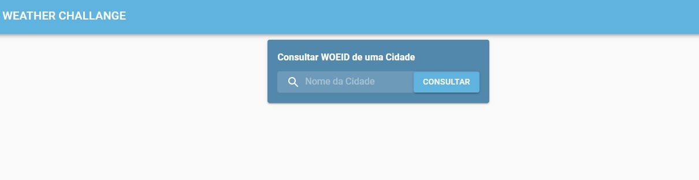
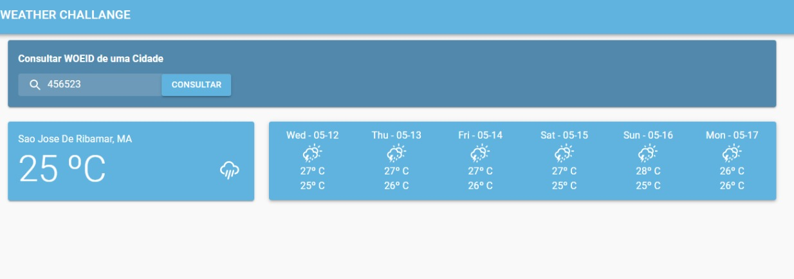

<h1 align="center">Weather REACT APP</h1>

<div align="center">
Plataforma cujo objetivo é <strong>listar a previsão do tempo de uma cidade</strong> para o dia atual e o restante da semana.
</div>
## Indice

<p align="center">
 <a href="#Features">Features</a> •
 <a href="#roadmap">Pré Requisitos</a> • 
 <a href="#tecnologias">Tecnologias</a> • 
 <a href="#autor">Autor</a> • 
</p>
<h4 align="center"> 
	Weather - Concluido.
</h4>

### Features

- Global
    - [x] Listagem de Weathers por WOEID
    - [x] Listagem de Weathers por nome de uma cidade 
### Screens

* Home do Front


* Results View



### Pré-requisitos

Antes de começar, você vai precisar ter instalado em sua máquina as seguintes ferramentas:
[Git](https://git-scm.com).

### 🎲 1 - Rodando o Front

```bash
# Clone este repositório
$ git clone <https://github.com/werliton/weather-react>

# Acesse a pasta do projeto no terminal/cmd
$ cd weather-react

# Instale as dependências
$ npm install

# Execute a aplicação em modo de desenvolvimento
$ npm start
```

### Tecnologias

As seguintes ferramentas foram usadas na construção do projeto:

- [React](https://pt-br.reactjs.org/)
- [React Router](https://reactrouter.com/)
- [TypeScript](https://www.typescriptlang.org/)
- [Redux Toolkit](https://redux-toolkit.js.org/)
- [Material UI](https://material-ui.com/)
- [D3](https://redux-toolkit.js.org/)
- [API](https://api.hgbrasil.com/weather)

### Autor
---

<a href="https://www.linkedin.com/in/werliton-silva/">
 
 <br />
 <sub><b>Werliton Silva</b></sub></a> <a href="hhttps://www.linkedin.com/in/werliton-carlos-206b5b70/" title="Rocketseat">🚀</a>

[](https://www.linkedin.com/in/werliton-carlos-206b5b70/) 
[](mailto:werlitoncarlos@gmail.com)